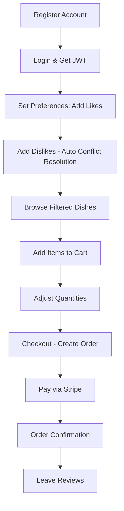
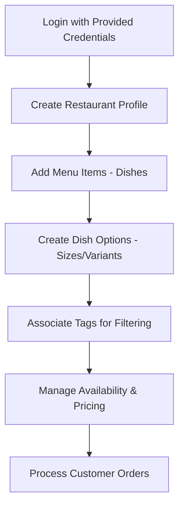
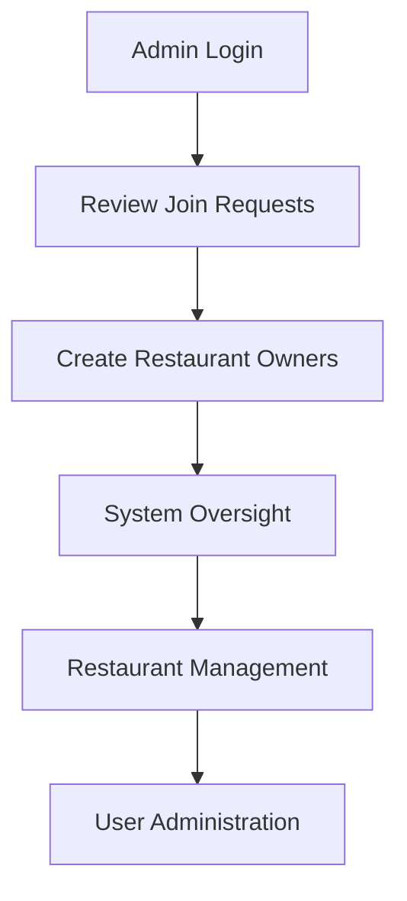
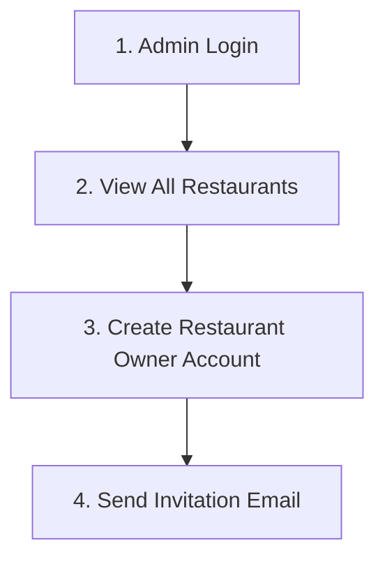
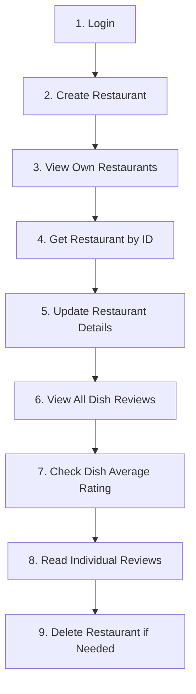
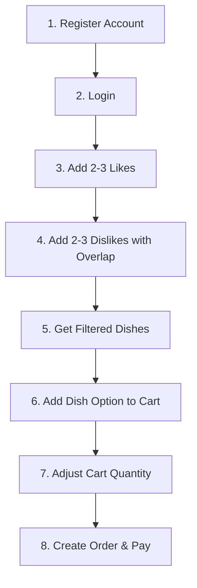

# Happy Beans Food Delivery Application
## Complete Workflow for Presentation

---

## Table of Contents
1. [System Overview](#system-overview)
2. [User Flow Narratives](#user-flow-narratives)
3. [Endpoint Reference](#endpoint-reference)
4. [Key Features & Business Logic](#key-features--business-logic)

---
## Things to Update (28.Aug)

### email
- admin sends email to restaurant owner : register approved (with pw)
- app sends email to user/member : order is placed

### Add some short description with storytelling

- Admin check restaurants, create other admin, create restaurant owners and send emails
- Admin can delete restaurants, users

---


## System Overview

**Happy Beans** is a sophisticated Kotlin Spring Boot food delivery application featuring:
- **Role-based Access Control**: Admin, Restaurant Owner, User/Member
- **Intelligent Filtering**: Tag-based meal recommendations with preference conflict resolution
- **Complete Order Management**: Cart → Order → Payment → Fulfillment
- **Integrated Payments**: Stripe webhook processing
- **Review System**: Dish and restaurant reviews

---

## User Flow Narratives

### **User/Member Complete Journey**



**Detailed Flow:**
1. **Registration** → Creates account with USER role
2. **Authentication** → JWT token for all subsequent requests
3. **Preference Setup** → Add multiple likes/dislikes with automatic conflict resolution
4. **Discovery** → Get personalized dish recommendations based on preferences
5. **Shopping** → Add dishes to cart, adjust quantities, review total
6. **Ordering** → Convert cart to order with payment integration
7. **Payment** → Stripe checkout with webhook confirmation
8. **Follow-up** → Order tracking and review submission

### **Restaurant Owner Journey**



**Detailed Flow:**
1. **Authentication** → Login with admin-provided credentials
2. **Restaurant Setup** → Create restaurant with hours, location, details
3. **Menu Creation** → Add dishes with multiple options (sizes, variants)
4. **Tag Management** → Associate dietary/preference tags with dishes
5. **Operations** → Update availability, pricing, restaurant status
6. **Order Management** → View and process customer orders

### **Admin Journey**



**Detailed Flow:**
1. **Authentication** → Admin login with elevated privileges
2. **Application Review** → Process restaurant owner applications
3. **User Management** → Create restaurant owners, send invitations
4. **System Administration** → Monitor restaurants, manage system health
5. **Oversight** → Delete problematic restaurants, manage user accounts

---

## Endpoint Reference

### **Authentication Endpoints**

| User Type | Method | Endpoint | Purpose |
|-----------|--------|----------|---------|
| User | `POST` | `/api/member/auth/sign-up` | User registration |
| User | `POST` | `/api/member/auth/login` | User login |
| Restaurant Owner | `POST` | `/api/auth/restaurant-owner/login` | Owner login |
| Admin | `POST` | `/api/admin/auth/login` | Admin login |

### **User/Member Endpoints**

#### Preference Management
| Method | Endpoint | Purpose | Request Body |
|--------|----------|---------|--------------|
| `GET` | `/api/member/likes` | View current likes | - |
| `POST` | `/api/member/likes` | Add likes (removes from dislikes) | `{"tagNames": ["spicy", "vegetarian"]}` |
| `DELETE` | `/api/member/likes` | Remove likes | `{"tagNames": ["spicy"]}` |
| `PUT` | `/api/member/likes` | Replace all likes | `{"tagNames": ["new1", "new2"]}` |
| `GET` | `/api/member/dislikes` | View current dislikes | - |
| `POST` | `/api/member/dislikes` | Add dislikes (removes from likes) | `{"tagNames": ["bitter", "spicy"]}` |
| `DELETE` | `/api/member/dislikes` | Remove dislikes | `{"tagNames": ["bitter"]}` |
| `PUT` | `/api/member/dislikes` | Replace all dislikes | `{"tagNames": ["new1", "new2"]}` |

#### Discovery & Shopping
| Method | Endpoint | Purpose | Request Body |
|--------|----------|---------|--------------|
| `GET` | `/api/member/dishes/search` | Get filtered dishes by preferences | - |
| `GET` | `/api/member/cart` | View cart contents | - |
| `POST` | `/api/member/cart/dish/{dishId}/dish-option/{dishOptionId}` | Add to cart | `{"quantity": 2}` |
| `PATCH` | `/api/member/cart/dish-option/{dishOptionId}` | Update quantity | `{"quantity": 5}` |
| `DELETE` | `/api/member/cart/dish-option/{dishOptionId}` | Remove item | - |
| `DELETE` | `/api/member/cart` | Clear cart | - |

#### Orders & Payment
| Method | Endpoint | Purpose | Response |
|--------|----------|---------|----------|
| `GET` | `/api/member/orders` | View order history | `OrderListResponse` |
| `GET` | `/api/member/orders/{orderId}` | View specific order | `OrderResponse` |
| `POST` | `/api/member/orders/cart-checkout` | Checkout cart | `{"paymentUrl": "stripe_url"}` |
| `POST` | `/api/member/orders/buy-dish/{dishOptionId}` | Direct dish purchase | `{"paymentUrl": "stripe_url"}` |

### **Restaurant Owner Endpoints**

#### Restaurant Management
| Method | Endpoint | Purpose | Request Body |
|--------|----------|---------|--------------|
| `GET` | `/api/restaurant-owner/restaurants` | View owned restaurants | - |
| `POST` | `/api/restaurant-owner/restaurants` | Create restaurant | `RestaurantCreateRequest` |
| `GET` | `/api/restaurant-owner/restaurants/{id}` | View restaurant details | - |
| `PATCH` | `/api/restaurant-owner/restaurants/{id}` | Update restaurant | `RestaurantPatchRequest` |
| `DELETE` | `/api/restaurant-owner/restaurants/{id}` | Delete restaurant | - |

#### Menu Management
| Method | Endpoint | Purpose | Request Body |
|--------|----------|---------|--------------|
| `POST` | `/api/restaurant-owner/restaurant/{id}/dishes` | Create dish | `DishCreateRequest` |
| `GET` | `/api/restaurant-owner/dish/{dishId}` | View dish details | - |
| `PUT` | `/api/restaurant-owner/dish/{dishId}` | Update dish | `DishUpdateRequest` |
| `PATCH` | `/api/restaurant-owner/dish/{dishId}` | Partial dish update | `DishPatchRequest` |
| `DELETE` | `/api/restaurant-owner/dish/{dishId}` | Delete dish | - |
| `POST` | `/api/restaurant-owner/dish/{dishId}/options` | Add dish option | `DishOptionCreateRequest` |
| `PUT` | `/api/restaurant-owner/dish-options/{optionId}` | Update option | `DishOptionUpdateRequest` |
| `DELETE` | `/api/restaurant-owner/dish-options/{optionId}` | Delete option | - |

#### Tag Management
| Method | Endpoint | Purpose | Request Body |
|--------|----------|---------|--------------|
| `GET` | `/api/restaurant-owner/dish-options/{optionId}/tags` | View option tags | - |
| `POST` | `/api/restaurant-owner/dish-options/{optionId}/tags` | Add tag | `{"tagName": "vegetarian"}` |
| `DELETE` | `/api/restaurant-owner/dish-options/{optionId}/tags` | Remove tag | `{"tagName": "spicy"}` |
| `PUT` | `/api/restaurant-owner/dish-options/{optionId}/tags` | Replace all tags | `{"tagNames": ["tag1", "tag2"]}` |

### **Admin Endpoints**

| Method | Endpoint | Purpose | Request Body |
|--------|----------|---------|--------------|
| `POST` | `/api/admin/create-admin` | Create admin user | `UserCreateRequestDto` |
| `POST` | `/api/admin/restaurant-owner` | Create restaurant owner | `RestaurantOwnerRequestDto` |
| `GET` | `/api/admin/join-request` | View join requests | - |
| `POST` | `/api/admin/join-request/accept/{id}` | Accept application | - |
| `POST` | `/api/admin/join-request/reject/{id}` | Reject application | - |
| `GET` | `/api/admin/restaurants` | View all restaurants | - |
| `DELETE` | `/api/admin/restaurants/{id}` | Delete restaurant | - |
| `PATCH` | `/api/admin/restaurants/{id}/status` | Update restaurant status | `{"status": "ACTIVE"}` |

### **Public/Guest Endpoints**

| Method | Endpoint | Purpose | Request Body |
|--------|----------|---------|--------------|
| `GET` | `/api/guest/restaurant` | Browse restaurants | - |
| `GET` | `/api/guest/{restaurantId}/dishes` | View restaurant menu | - |
| `POST` | `/api/guest/join-request` | Apply to be restaurant owner | `JoinRequestDto` |

### **System/Shared Endpoints**

| Method | Endpoint | Purpose | Request Body |
|--------|----------|---------|--------------|
| `GET` | `/api/tags` | View all system tags | - |
| `POST` | `/api/tags` | Create new tags | `{"tagNames": ["tag1", "tag2"]}` |
| `GET` | `/api/health` | System health check | - |

### **Payment Webhook**

| Method | Endpoint | Purpose | Triggered By |
|--------|----------|---------|--------------|
| `POST` | `/api/payment/webhook` | Process payment events | Stripe webhook |

---

## Key Features & Business Logic

### **Intelligent Preference System**
- **Automatic Conflict Resolution**: Adding to likes removes from dislikes (and vice versa)
- **Smart Filtering**: Dishes with disliked tags excluded, liked tags prioritized
- **Fallback Logic**: Shows all dishes if no preferences set
- **Real-time Updates**: Preferences immediately affect dish recommendations

### **Cart Management**
- **Quantity Adjustment**: Update existing items or add new ones
- **Availability Checking**: Validates dish options before adding
- **Total Calculation**: Real-time cart totals with item details
- **Persistent State**: Cart survives between sessions until checkout

### **Payment Processing**
- **Stripe Integration**: Secure payment processing with webhooks
- **Order States**: PENDING → COMPLETED/REJECTED based on payment
- **Email Notifications**: Automatic confirmation/failure emails
- **Cart Clearing**: Successful payment clears cart automatically

### **Security & Authorization**
- **JWT Authentication**: Token-based auth with role verification
- **Resource Ownership**: Users can only access their own data
- **Role-based Access**: Different endpoints for different user types
- **Input Validation**: Comprehensive request validation with annotations

---

## **MUST-HAVE DEMONSTRATION FLOWS**

### **Admin Complete Flow (Realistic Order)**


**Step-by-Step Demo:**
```bash
# 1. Admin Login
POST /api/admin/auth/login
{
  "email": "admin@happybeans.com",
  "password": "admin123"
}
# Response: {"token": "eyJhbGciOi..."}

# 2. View All Restaurants (System Overview)
GET /api/admin/restaurants
# Response: List of all restaurants in system

# 3. Create New Restaurant Owner
POST /api/admin/restaurant-owner
{
  "email": "newowner@restaurant.com",
  "firstName": "New",
  "lastName": "Owner"
}
# Response: {"message": "RestaurantOwner created!"}
# Auto-generates password and sends invitation email
```

### **Restaurant Owner Complete Flow (Realistic Order)**


**Step-by-Step Demo:**
```bash
# 1. Restaurant Owner Login
POST /api/auth/restaurant-owner/login
{
  "email": "owner@restaurant.com",
  "password": "generated_password_from_admin"
}

# 2. Create Restaurant
POST /api/restaurant-owner/restaurants
{
  "name": "Demo Pizza Palace",
  "description": "Best pizza in town",
  "addressUrl": "123 Main St",
  "image": "restaurant-image.jpg"
}

# 3. View All Own Restaurants
GET /api/restaurant-owner/restaurants
# Response: List of restaurants owned by this user

# 4. Get Specific Restaurant Details
GET /api/restaurant-owner/restaurants/{restaurantId}
# Response: Full restaurant details

# 5. Update Restaurant Information
PATCH /api/restaurant-owner/restaurants/{restaurantId}
{
  "description": "Updated: The best pizza place in the city!"
}

# 6. View All Dish Reviews for Restaurant - MISSING ENDPOINT
GET /api/restaurant-owner/reviews/dish
# Response: All dish reviews for owner's restaurants

# 7. Get Average Rating for Dish Option - MISSING ENDPOINT
GET /api/restaurant-owner/reviews/dish/average-rating/{dishOptionId}
# Response: {"averageRating": 4.2}

# 8. View Individual Dish Reviews - MISSING ENDPOINT
GET /api/restaurant-owner/reviews/dish/{dishOptionId}
# Response: List of reviews with rating and message

# 9. Delete Restaurant (if needed)
DELETE /api/restaurant-owner/restaurants/{restaurantId}
# Response: {"message": "Restaurant deleted successfully"}
```

### **Member/User Complete Flow (Realistic Order)**


**Step-by-Step Demo:**
```bash
# 1. User Registration
POST /api/member/auth/sign-up
{
  "email": "demo@user.com",
  "password": "user123",
  "firstName": "Demo",
  "lastName": "User"
}

# 2. User Login
POST /api/member/auth/login
{
  "email": "demo@user.com",
  "password": "user123"
}

# 3. Add 2-3 Likes
POST /api/member/likes
{
  "tagNames": ["vegetarian", "spicy", "cheese"]
}

# 4. Add 2-3 Dislikes (with overlap to show conflict resolution)
POST /api/member/dislikes  
{
  "tagNames": ["bitter", "spicy", "seafood"]
}
# System automatically removes "spicy" from likes since it's in dislikes

# 5. Get Filtered Dishes (personalized recommendations)
GET /api/member/dishes/search
# Returns dishes WITHOUT bitter/seafood tags, prioritizing vegetarian/cheese

# 6. Add Dish Option to Cart
POST /api/member/cart/dish/{dishId}/dish-option/{dishOptionId}
{
  "quantity": 1
}

# 7. Adjust Quantity in Cart
PATCH /api/member/cart/dish-option/{dishOptionId}
{
  "quantity": 3
}

# 8. Order & Payment
POST /api/member/orders/cart-checkout
# Response: {"paymentUrl": "https://checkout.stripe.com/..."}
# User completes payment, webhook processes success
```

## **MISSING BEHAVIORS IDENTIFIED**

### **Restaurant Owner Missing Endpoints**
The following endpoints exist as services but are commented out in `ReviewController`:

| Status | Method | Missing Endpoint | Purpose | Implementation Needed |
|--------|--------|------------------|---------|----------------------|
| MISSING | `GET` | `/api/restaurant-owner/reviews/dish` | View all dish reviews for owner's restaurants | Uncomment & add @RestaurantOwner protection |
| MISSING | `GET` | `/api/restaurant-owner/reviews/dish/average-rating/{dishOptionId}` | Get average rating for dish option | Uncomment & add ownership validation |  
| MISSING | `GET` | `/api/restaurant-owner/reviews/restaurant` | View restaurant reviews for owned restaurants | Uncomment & add @RestaurantOwner protection |
| MISSING | `GET` | `/api/restaurant-owner/reviews/restaurant/average-rating/{restaurantId}` | Get average restaurant rating | Uncomment & add ownership validation |

### **Required Implementation Changes**

```kotlin
// In ReviewController.kt - Uncomment and protect these endpoints:

@RestController  
@RequestMapping("/api/restaurant-owner/reviews")
class ReviewController(
    private val dishReviewService: DishReviewService,
    private val restaurantReviewService: RestaurantReviewService,
) {
    
    @GetMapping("/dish")
    fun getAllDishReviews(@RestaurantOwner owner: User): List<DishReviewDto> {
        return dishReviewService.getAllReviewsForOwner(owner.id) // Add ownership filtering
    }

    @GetMapping("/dish/average-rating/{dishOptionId}")
    fun getAverageRatingForDishOption(
        @PathVariable dishOptionId: Long,
        @RestaurantOwner owner: User
    ): Double {
        // Add validation that dishOption belongs to owner's restaurant
        return dishReviewService.getAverageRatingForDishOption(dishOptionId)
    }

    @GetMapping("/restaurant/average-rating/{restaurantId}")
    fun getAverageRatingForRestaurant(
        @PathVariable restaurantId: Long,
        @RestaurantOwner owner: User  
    ): Double {
        // Add validation that restaurant belongs to owner
        return restaurantReviewService.getAverageRatingForRestaurant(restaurantId)
    }
}
```

## **IMPLEMENTATION PRIORITY**

### **Ready for Demo (Existing Endpoints)**
- **Admin**: Login, view restaurants, create restaurant owner
- **Restaurant Owner**: Login, CRUD restaurants, view own restaurants by ID, update/delete
- **Member**: Registration, login, preferences (likes/dislikes with conflict resolution), filtered dishes, cart management, order & payment

### **Missing for Complete Demo**
1. **Restaurant Owner Review Endpoints** (Services exist, controllers commented out)
   - View all dish reviews for owned restaurants  
   - Get average rating for dish options
   - View individual dish reviews with ratings and messages
   - Get restaurant average rating

### **Recommended Implementation Order**
1. **Uncomment** existing review endpoints in `ReviewController.kt`
2. **Add** `@RestaurantOwner` authorization to protect endpoints
3. **Add** ownership validation in service layer
4. **Test** complete demo flows

---

## **PRESENTATION READY FLOWS**

All endpoints below are **FULLY FUNCTIONAL** and ready for live demonstration:
  "email": "user@demo.com",
  "password": "password123",
  "firstName": "Demo",
  "lastName": "User"
}

# 2. Add Multiple Likes
POST /api/member/likes
{
  "tagNames": ["vegetarian", "spicy", "healthy"]
}

# 3. Add Dislikes (with overlap to show conflict resolution)
POST /api/member/dislikes
{
  "tagNames": ["bitter", "spicy"]  # "spicy" will be removed from likes
}

# 4. Get Filtered Dishes
GET /api/member/dishes/search
# Returns dishes without "bitter" or "spicy", prioritizing "vegetarian" and "healthy"

# 5. Add to Cart
POST /api/member/cart/dish/1/dish-option/2
{
  "quantity": 2
}

# 6. Adjust Quantity
PATCH /api/member/cart/dish-option/2
{
  "quantity": 3
}

# 7. Checkout
POST /api/member/orders/cart-checkout
# Response: {"paymentUrl": "https://checkout.stripe.com/..."}

# 8. Payment Success (webhook automatically processes)
# Order status: PENDING → COMPLETED
# Cart automatically cleared
```

### **Scenario 2: Restaurant Owner Setup**
```bash
# 1. Admin creates restaurant owner
POST /api/admin/restaurant-owner
{
  "email": "owner@restaurant.com",
  "firstName": "Restaurant",
  "lastName": "Owner"
}

# 2. Owner logs in
POST /api/auth/restaurant-owner/login
{
  "email": "owner@restaurant.com", 
  "password": "generated_password"
}

# 3. Create restaurant
POST /api/restaurant-owner/restaurants
{
  "name": "Demo Pizza Place",
  "description": "Best pizza in town",
  "workingHours": [...]
}

# 4. Add dish with options
POST /api/restaurant-owner/restaurant/1/dishes
{
  "name": "Margherita Pizza",
  "description": "Classic pizza",
  "dishOptionRequests": [
    {"name": "Small", "price": 12.99},
    {"name": "Large", "price": 18.99}
  ]
}

# 5. Add tags to dish options
POST /api/restaurant-owner/dish-options/1/tags
{
  "tagNames": ["vegetarian", "cheese", "tomato"]
}
```

### **Scenario 3: Admin Oversight**
```bash
# 1. View join requests
GET /api/admin/join-request

# 2. Accept application
POST /api/admin/join-request/accept/1

# 3. Monitor all restaurants
GET /api/admin/restaurants

# 4. Update restaurant status
PATCH /api/admin/restaurants/1/status
{
  "status": "INACTIVE"
}
```

---

## System Statistics & Capabilities

- **User Types**: 3 (Admin, Restaurant Owner, Member)
- **Total Endpoints**: 50+ RESTful endpoints
- **Authentication**: JWT-based with role verification
- **Database**: PostgreSQL with JPA/Hibernate
- **Payment**: Stripe integration with webhooks
- **Filtering**: Advanced tag-based recommendation system
- **Reviews**: Dual system for dishes and restaurants
- **Real-time**: Preference conflict resolution and cart updates

---

*This documentation covers the complete Happy Beans food delivery application workflow suitable for the demonstration.*