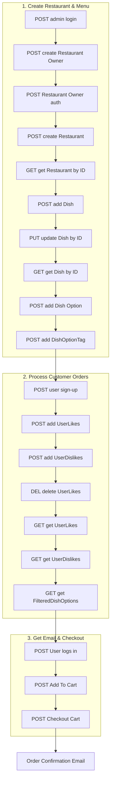

# Happy Beans Backend API

Welcome! Our team, **Happy Beans**, has developed a backend API for a food ordering platform. This project focuses on providing a **robust, extensible API** that enables users to order food from restaurants with a **personalized experience**. Our API serves **three distinct user types**: regular members, restaurant owners, and administrators.

---
## Table of Contents
1. [API Features](#api-features)
2. [Tech & Architecture](#tech---architecture)
3. [System Diagram & Key Components](#system-diagram--key-components)
4. [Flow](#flow)
5. [Spring REST Docs](#spring-rest-docs)
6. [Stripe Payment Integration](#stripe-payment-integration)
7. [AWS Setup](#aws-setup)
8. [Email Dispatching](#email-dispatching)

---
## API Features

### Personalized Recommendations
Our API allows users to specify **likes and dislikes** using tags, which are then used to **filter and rank dishes**.

### Secure Authentication
The API utilizes a **role-based access system** with **JWTs** for authentication.

### Integrated Payment System
We have seamlessly integrated the **Stripe API** to handle payments.  
The API manages the **entire payment lifecycle**, from creating a secure checkout session to processing webhook events for **payment success or failure**.

### Comprehensive Documentation
The API endpoints are well-documented using **Spring Rest Docs**, providing **clear and up-to-date information** on request/response formats, path parameters, and error codes.

---

## Tech - Architecture

### Tech Stack
- **Language & Framework:** Kotlin + Spring Boot with Spring Data JPA
- **Build Tool:** Gradle
- **Database:** PostgreSQL on AWS RDS, H2 for testing
- **Authentication:** JWTs with **custom interceptors** for role-based access
- **Payment Integration:** Stripe API for handling payments and webhooks
- **Testing:** SpringBootTest, Mockito/MockK for mocking, Postman for manual testing
- **Documentation** Spring REST docs, GitHub wiki

### System Diagram & Key Components
The application follows a **modular, layered architecture**:

- **Controllers:** Top layer handling HTTP requests for **members, restaurant owners, and admins**
- **Services:** Business logic layer with core functionality like `CartProductService` and `MemberOrderService`
- **Repositories:** Data persistence using **Spring Data JPA**
- **Infrastructure:** Houses key components like `JwtProvider` for **token management**
- **Interceptors:** Custom `HandlerInterceptor` implementations enforce **role-based access control**

The **production infrastructure** is deployed on an **AWS EC2 instance** and monitored.

---
## Flow
### **Complete Workflow**

**Detailed Flow**
Explanation

Phase 1 – Create Restaurant & Menu
1.	Admin login → Authenticate as admin.
2.	Create Restaurant Owner → Admin registers a new owner.
3.	Owner auth → Owner logs in to get a JWT.
4.	Create Restaurant → Owner creates a restaurant profile.
5.	Get Restaurant by ID → Verify creation.
6.	Add Dish → Owner adds a new dish.
7.	Update Dish by ID → Adjust details (price, description, etc.).
8.	Get Dish by ID → Confirm the dish exists.
9.	Add Dish Option → Add customizable option (e.g., extra topping).
10.	Add DishOptionTag → Categorize options for filtering.

⸻

Phase 2 – Process Customer Orders
1.	User sign-up → New customer registers.
2.	Add UserLikes → User specifies preferred tags (e.g., “tofu”).
3.	Add UserDislikes → User specifies dislikes (e.g., “peanuts”).
4.	Delete UserLikes → Remove a like if needed.
5.	Get UserLikes → Fetch current likes.
6.	Get UserDislikes → Fetch current dislikes.
7.	Get FilteredDishOptions → Personalized menu shown, excluding dislikes and prioritizing likes.

⸻

Phase 3 – Get Email & Checkout
1.	User logs in → Authenticate and receive JWT.
2.	Add To Cart → Add dish with selected options.
3.	Checkout Cart → Place order, trigger payment (Stripe) and send confirmation email.

⸻
## Endpoint Reference

**Total Endpoints: 50**

### **Authentication Endpoints (4)**

| User Type | Method | Endpoint | Purpose |
|-----------|--------|----------|---------|
| Member | `POST` | `/api/member/auth/sign-up` | User registration |
| Member | `POST` | `/api/member/auth/login` | User authentication |
| Admin | `POST` | `/api/admin/auth/login` | Admin authentication |
| Restaurant Owner | `POST` | `/api/auth/restaurant-owner/login` | Owner authentication |

### **Admin Endpoints (8)**

| Method | Endpoint | Purpose | Request Body |
|--------|----------|---------|--------------|
| `POST` | `/api/admin/create-admin` | Create admin user | `UserCreateRequestDto` |
| `POST` | `/api/admin/restaurant-owner` | Create restaurant owner | `RestaurantOwnerRequestDto` |
| `GET` | `/api/admin/join-request` | View join requests | - |
| `POST` | `/api/admin/join-request/accept/{id}` | Accept application | - |
| `POST` | `/api/admin/join-request/reject/{id}` | Reject application | - |
| `GET` | `/api/admin/restaurants` | View all restaurants | - |
| `DELETE` | `/api/admin/restaurants/{restaurantId}` | Delete restaurant | - |
| `PATCH` | `/api/admin/restaurants/{restaurantId}/status` | Update restaurant status | `{"status": "ACTIVE"}` |

### **Restaurant Owner Endpoints (20)**

#### Restaurant Management
| Method | Endpoint | Purpose | Request Body |
|--------|----------|---------|--------------|
| `GET` | `/api/restaurant-owner/restaurants` | View owned restaurants | - |
| `POST` | `/api/restaurant-owner/restaurants` | Create restaurant | `RestaurantCreateRequest` |
| `GET` | `/api/restaurant-owner/restaurants/{restaurantId}` | View restaurant details | - |
| `PATCH` | `/api/restaurant-owner/restaurants/{restaurantId}` | Update restaurant | `RestaurantPatchRequest` |
| `DELETE` | `/api/restaurant-owner/restaurants/{restaurantId}` | Delete restaurant | - |

#### Dish Management
| Method | Endpoint | Purpose | Request Body |
|--------|----------|---------|--------------|
| `POST` | `/api/restaurant-owner/restaurant/{restaurantId}/dishes` | Create dish | `DishCreateRequest` |
| `GET` | `/api/restaurant-owner/dish/{dishId}` | View dish details | - |
| `PUT` | `/api/restaurant-owner/dish/{dishId}` | Update dish | `DishUpdateRequest` |
| `PATCH` | `/api/restaurant-owner/dish/{dishId}` | Partial dish update | `DishPatchRequest` |
| `DELETE` | `/api/restaurant-owner/dish/{dishId}` | Delete dish | - |

#### Dish Option Management
| Method | Endpoint | Purpose | Request Body |
|--------|----------|---------|--------------|
| `POST` | `/api/restaurant-owner/dish/{dishId}/options` | Add dish option | `DishOptionCreateRequest` |
| `PUT` | `/api/restaurant-owner/dish-options/{dishOptionId}` | Update option | `DishOptionUpdateRequest` |
| `DELETE` | `/api/restaurant-owner/dish-options/{dishOptionId}` | Delete option | - |

#### Dish Option Tag Management
| Method | Endpoint | Purpose | Request Body |
|--------|----------|---------|--------------|
| `GET` | `/api/restaurant-owner/dish-options/{dishOptionId}/tags` | View option tags | - |
| `POST` | `/api/restaurant-owner/dish-options/{dishOptionId}/tags` | Add tag to option | `{"tagName": "vegetarian"}` |
| `DELETE` | `/api/restaurant-owner/dish-options/{dishOptionId}/tags` | Remove tag from option | `{"tagName": "spicy"}` |
| `PUT` | `/api/restaurant-owner/dish-options/{dishOptionId}/tags` | Replace all option tags | `{"tagNames": ["tag1", "tag2"]}` |

#### Order Management
| Method | Endpoint | Purpose | Request Body |
|--------|----------|---------|--------------|
| `GET` | `/api/restaurant-owner/orders/order-details` | View all order details | - |
| `GET` | `/api/restaurant-owner/orders/order-details/{orderDetailId}` | View specific order detail | - |
| `PATCH` | `/api/restaurant-owner/orders/order-details/{orderDetailId}/status` | Update order detail status | `{"status": "CONFIRMED"}` |

### **Member Endpoints (19)**

#### Preference Management
| Method | Endpoint | Purpose | Request Body |
|--------|----------|---------|--------------|
| `GET` | `/api/member/likes` | View current likes | - |
| `POST` | `/api/member/likes` | Add likes (removes from dislikes) | `{"tagNames": ["spicy", "vegetarian"]}` |
| `DELETE` | `/api/member/likes` | Remove likes | `{"tagNames": ["spicy"]}` |
| `PUT` | `/api/member/likes` | Replace all likes | `{"tagNames": ["new1", "new2"]}` |
| `GET` | `/api/member/dislikes` | View current dislikes | - |
| `POST` | `/api/member/dislikes` | Add dislikes (removes from likes) | `{"tagNames": ["bitter", "spicy"]}` |
| `DELETE` | `/api/member/dislikes` | Remove dislikes | `{"tagNames": ["bitter"]}` |
| `PUT` | `/api/member/dislikes` | Replace all dislikes | `{"tagNames": ["new1", "new2"]}` |

#### Discovery & Shopping
| Method | Endpoint | Purpose | Request Body |
|--------|----------|---------|--------------|
| `GET` | `/api/member/dishes/search` | Get filtered dishes by preferences | - |
| `GET` | `/api/member/cart` | View cart contents | - |
| `POST` | `/api/member/cart/dish/{dishId}/dish-option/{dishOptionId}` | Add to cart | `{"quantity": 2}` |
| `PATCH` | `/api/member/cart/dish-option/{dishOptionId}` | Update quantity | `{"quantity": 5}` |
| `DELETE` | `/api/member/cart/dish-option/{dishOptionId}` | Remove item | - |
| `DELETE` | `/api/member/cart` | Clear cart | - |

#### Orders & Payment
| Method | Endpoint | Purpose | Response |
|--------|----------|---------|----------|
| `GET` | `/api/member/orders` | View order history | `OrderListResponse` |
| `GET` | `/api/member/orders/{orderId}` | View specific order | `OrderResponse` |
| `POST` | `/api/member/orders/cart-checkout` | Checkout cart | `{"paymentUrl": "stripe_url"}` |
| `POST` | `/api/member/orders/buy-dish/{dishOptionId}` | Direct dish purchase | `{"paymentUrl": "stripe_url"}` |

#### Reviews
| Method | Endpoint | Purpose | Request Body |
|--------|----------|---------|--------------|
| `POST` | `/api/member/reviews/dish` | Submit dish review | `DishReviewCreateRequest` |

### **Guest Endpoints (3)**

| Method | Endpoint | Purpose | Request Body |
|--------|----------|---------|--------------|
| `GET` | `/api/guest/restaurant` | Browse restaurants | - |
| `GET` | `/api/guest/{restaurantId}/dishes` | View restaurant menu | - |
| `POST` | `/api/guest/join-request` | Apply to be restaurant owner | `JoinRequestDto` |

### **Shared System Endpoints (3)**

| Method | Endpoint | Purpose | Request Body |
|--------|----------|---------|--------------|
| `GET` | `/api/tags` | View all system tags | - |
| `POST` | `/api/tags` | Create new tags | `{"tagNames": ["tag1", "tag2"]}` |
| `GET` | `/api/health` | System health check | - |

### **Payment Webhook (1)**

| Method | Endpoint | Purpose | Triggered By |
|--------|----------|---------|--------------|
| `POST` | `/api/payment/webhook` | Process payment events | Stripe webhook |

### **Review System Endpoints (2) - Currently Commented Out**

| Status | Method | Endpoint | Purpose | Security |
|--------|--------|----------|---------|----------|
| INACTIVE | `GET` | `/api/restaurant-owner/reviews/dish` | View dish reviews for owned restaurants | @RestaurantOwner |
| INACTIVE | `GET` | `/api/restaurant-owner/reviews/dish/average-rating/{dishOptionId}` | Get average rating for dish option | @RestaurantOwner |

---

## Spring REST Docs

**Spring REST Docs** generates accurate API documentation directly from tests.
Instead of writing docs manually, you write tests, and Spring REST Docs produces snippets in AsciiDoc that later become full HTML documentation.
This ensures that your API documentation is always **up to date and consistent** with your code.

**Why use it?**
- Docs = truth from tests → no outdated API descriptions.
- Lightweight → no extra runtime dependencies.
- Flexible → you choose how docs are structured and styled.
- Clean code → no need for annotations inside controllers.
- Version control friendly → snippets and AsciiDoc live in the repo.

**Required Dependencies (Gradle Kotlin DSL)**
These dependencies allow Spring REST Docs to capture request/response information during tests and convert them into **snippets**.
```
    dependencies {
    // Core Spring REST Docs
    testImplementation("org.springframework.restdocs:spring-restdocs-mockmvc")
    // or for REST Assured
    testImplementation("org.springframework.restdocs:spring-restdocs-restassured")
    // Asciidoctor plugin support
    asciidoctorExt("org.springframework.restdocs:spring-restdocs-asciidoctor")
}
```

**Plugins (Gradle)**
The Asciidoctor plugin is used to transform your snippets and .adoc files into **HTML or PDF documentation**.
```kotlin
plugins {
    id("org.asciidoctor.jvm.convert") version "3.3.2"
}
```

**Gradle Setup (snippets + build tasks)**
This configuration ensures:
1.	Tests produce snippets.
2.	Asciidoctor assembles snippets into final docs.
3.	Docs are automatically copied into static/docs and also packaged inside the final JAR.
```kotlin
// In build.gradle.kts

val snippetsDir by extra { "build/generated-snippets" }

tasks.test {
    // Make sure tests output snippets here
    outputs.dir(snippetsDir)
}

tasks.asciidoctor {
    // Use the snippets directory produced by tests
    inputs.dir(snippetsDir)
    configurations("asciidoctorExt")
    dependsOn(tasks.test)
    baseDirFollowsSourceFile()
}

//Copy built docs into static resources (useful for local preview and packaged app)
tasks.register<Copy>("copyDocs") {
    dependsOn(tasks.asciidoctor)
    // Copy only the final HTML (index.html) produced by Asciidoctor
    from("${tasks.asciidoctor.get().outputDir}/index.html")
    into("src/main/resources/static/docs")
}

//Package docs into the JAR under static/docs/
tasks.bootJar {
    dependsOn(tasks.asciidoctor)
    from("${tasks.asciidoctor.get().outputDir}/index.html") {
        into("static/docs")
    }
}
```

**Works with Testing Libraries**
Works with Testing Libraries
- MockMvc → for Spring MVC controllers.
- REST Assured → for full HTTP-level testing.
- WebTestClient → for reactive APIs.

```mermaid
A[Write Tests<br/>(MockMvc / RestAssured / WebTestClient)] --> B[Run Tests]
B --> C[Generate Snippets<br/>(HTTP request/response, fields, etc.)]
C --> D[Assemble AsciiDoc<br/>(index.adoc + includes)]
D --> E[Convert with Asciidoctor]
E --> F[Final Docs<br/>(HTML / PDF)]
```

## Stripe Payment Integration

For payments, we integrated **Stripe Checkout**. Instead of building our own UI for payment forms, we’re leveraging Stripe’s hosted checkout session, which handles all the heavy lifting—security, validation, and different payment methods.

Here’s how the flow works:

* A checkout session is created when the user initiates a payment.
* Once the payment succeeds, Stripe calls back to our **success endpoint**.
* Inside that callback, we grab the **order ID from the payment metadata**.
* Using that ID, we update both the **payment record** and the **order status** in our system.

That way, everything stays in sync automatically once Stripe confirms the transaction.

## Email Dispatching

On certain events like order confirmations or notifications we send out emails.
We’re handling this with **Java Mailer**, and right now we’re using Gmail as the SMTP provider.
It’s a lightweight setup but reliable enough for our current needs.

---

## AWS Setup

For infrastructure, we’re using **AWS Application Load Balancer (ALB)** in front of our application.

* The ALB is handling the routing of traffic to our app.
* We’ve set up **AWS Certificate Manager** to issue and manage our HTTPS certificate.
* This way, all traffic is secure by default, without us needing to worry about certificate renewals.

---

### Production & Performance

* CI/CD and Deployment
* The pipeline begins with a commit to the main branch of our Git repository.
* **Pre-Build Stage** - The buildspec.yml first grants execute permissions to Gradle wrapper.
* **Build Stage** - With the environment ready, the command ./gradlew bootJar is executed.
* AWS CodeDeploy handles the deployment to the EC2 instance.
* appspec.yml file is the central command for this phase, orchestrating the deployment lifecycle on our single EC2 instance.
* scripts/before_install.sh - ensures a clean slate and frees up the port for the new version.
* scripts/after_install.sh - - Setting file ownership and permissions for the new JAR.
* The start.sh script launches the new JAR file. It includes a smart health check loop that continuously polls the /api/health endpoint.

### Logging & Monitoring
Logging: We use Logback for structured logging, and a custom CorrelationIdFilter assigns a unique correlationId to each request. This allows for end-to-end tracing of a request across all services.
Monitoring: Logs from the EC2 instance are pushed to AWS CloudWatch, providing a centralized location for real-time monitoring, log analysis, and performance metric tracking.

---

## Reflection
**What we’d do differently next time”**

Since this was a 3-week sprint with all of us still learning, we definitely learned a lot the hard way. If we did it again, we’d start by putting more effort into **system design** — both high-level architecture and low-level details. We kind of jumped straight into coding and later realized we were missing diagrams and a clear picture of how things should fit together. We’d also focus on **team communication and coding standards** earlier on. Sometimes our code looked like it was written by four different people… because it was. A bit more alignment upfront would have saved us time fixing things later. So yeah — next time, better planning, clearer design, and cleaner teamwork.


